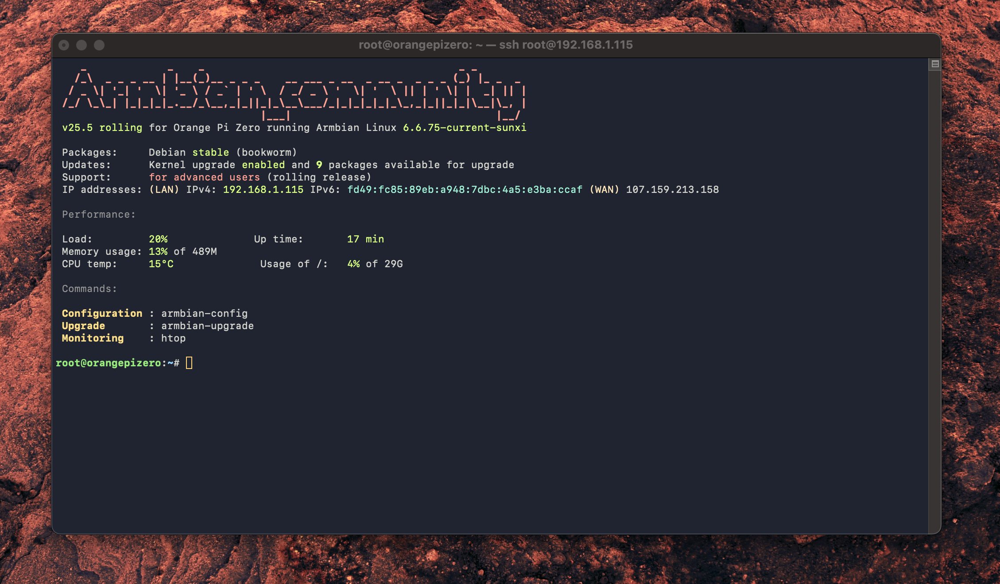
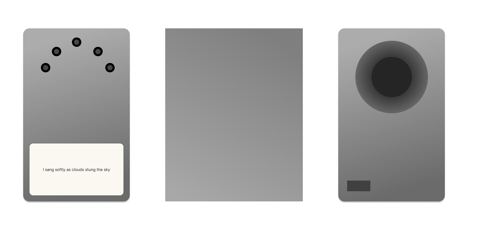

# Dev Log

My strategy in building out the basic architecture is of course first exploring what's out there in terms of APIs for TikTok et al. Unfortunately it seems the [Research API](https://developers.tiktok.com/products/research-api/) is not available in Canada. 
Thankfully, access by unofficial means seems to be available though 3rd party libraries (primarily in Python), chiefly via [PykTok](https://pypi.org/project/pyktok/).

## Hardware Exploration - 2025.01.30

I am going to first test the Olimex A20-OlinuXino. This board offers a linux platform for python scripting which is likely going to be necessary. The plans for more low-level hardware are unlikely to proceed given the API and the A/V complexity. On the other hand, this opens up the possiblity of using a display.

--

UPDATE: The A20-OlinuXino-LIME2 is not powerful enough to run pyktok. I will be switching to a Raspberry Pi 5.

## Software - 2025.01.31

It seems TikTok search is atrocious, by official and unofficial means. A better way of downloading content may be necessary. On the plus side, I can reliably search for and download TikTok video files.

I will go ahead with this PoC implementation to then test the other component parts of this architecture. YouTube, Vimeo or other platforms may be necessary to pivot to in case reliable content surfacing isn't possible on TikTok.

## Software - 2025.02.10

I've found https://filmot.com/, which offers a very compelling search product for almost exactly what I'm looking for, except it's YouTube-based and does not seem to offer an API. 3rd party projects exist to provide one, however. Upon investigation, it seems projects like [this](https://github.com/dusking/filmot) are abandonware and not implementable.

## Software - 2025.02.16

The technical challenge now is to get the audio clips _whittled down_ into morcels that actually represent the words being chosen. For this, OpenAI's whisper (available as FOSS locally and as a paid service at ~$0.006 per minute) as well as Vosk seem to be necessary to get far more accurate soundbytes out of YouTube files, which are downloading successfully.

## Software - 2025.03.01

The way the software stack is going, and the fact that I'm now processing YouTube videos primarily (though still hope to draw from other sources now as a stretch goal) - I've reconsidered the standalone device model. 

Audio clips are being served by a FastAPI service implementation, and I've now turned my attention towards the physical device. Since a server will do the number crunching, I'm free to implement something considerably lighter in compute power. I have experience with the ESP-IDF framework with regard to audio, which could make this a very economical project, but I'm not sure I want to commit to that degree of programming without leaving room for design iteration.

## Hardware - 2025.03.08
I've built a simple web front-end to alter the poem, and now I'm exploring design concepts for the physical device.

## Hardware - 2025.03.20
Hardware selection is now complete. The audio processing is to happen on a Teensy 4.0 and a associated Audio Shield, whilst the file fetching and server interactions are to be managed by an Orange Pi Zero.
The selection of the Teensy is largely due to its DSP strengths and robust audio library support. Whilst I'm not an expert, I've had positive experiences with Paul Stoffregen's work and his online [pseudo-IDE](https://www.pjrc.com/teensy/gui/index.html). The ESP-EDF framework would've been cool, but likely too technically challenging for me to commit to exploratively, and theESP32 LyraT v4.1 board I had on hand did not have the pinouts I needed to power an external display or extra peripherals. It also was rather forma-facotr limiting given its footprint.

## Hardware - 2025.03.24

Thank you, [Giuseppe](http://www.orangepi.org/orangepibbsen/forum.php?mod=viewthread&tid=2441)!  UART2 is `/dev/ttyS2` on the Orange Pi Zero. I'm now trying to get the last non-experiemntal piece of this puzzle working: communication of audio files from the Orange Pi to the Teensy. Explorations beyond paper and pencil in the design of the hardware are underway.

## Software - 2025.03.27

I've now got the audio file transfer working.